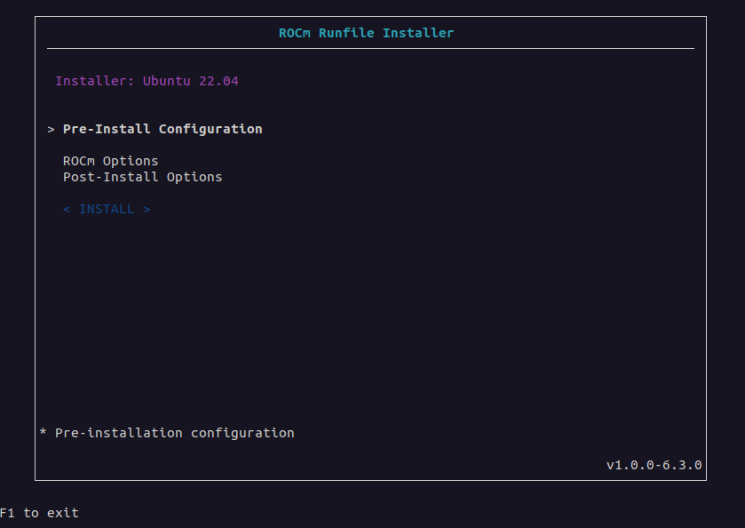
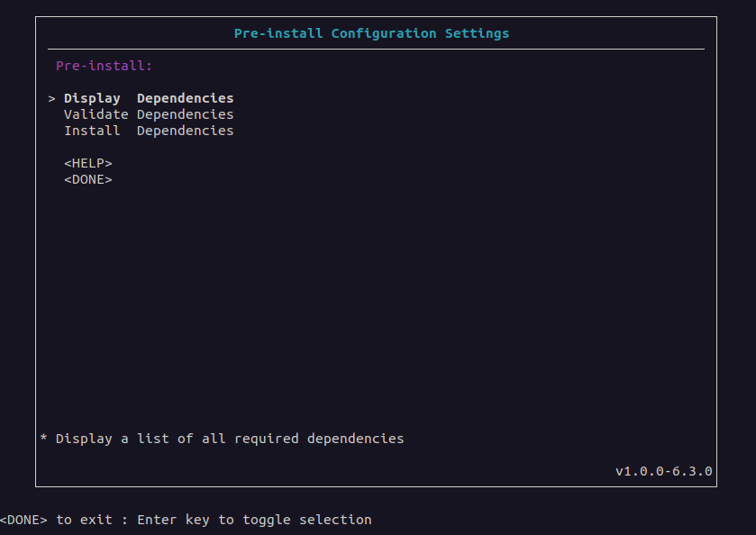
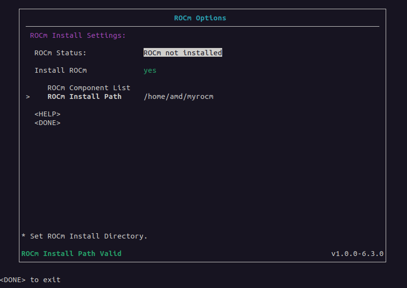
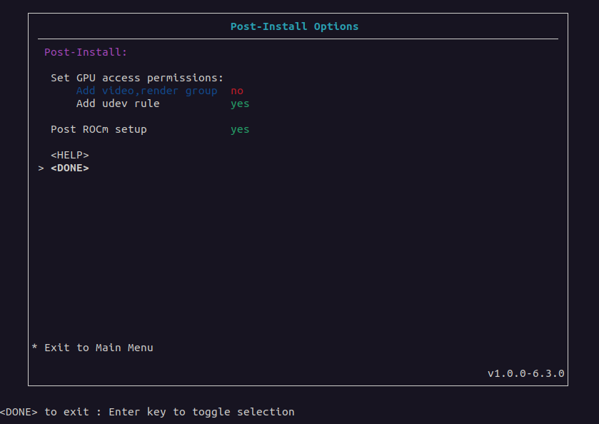

.. meta::
  :description: How to use the ROCm Runfile Installer
  :keywords: ROCm installation, AMD, ROCm, tools, Runfile installer

***************************************************************************
ROCm Runfile Installer
***************************************************************************

The ROCm Runfile Installer is a method of installing ROCm on a system with or without
network or internet access. Unlike all other methods for installing ROCm, the ROCm Runfile Installer
can install ROCm without using a native Linux package management system.

The key advantage of using the ROCm Runfile Installer is its offline installation support.
Many system environments have network or internet access restrictions, making installation via
normal package management difficult. Furthermore, some installation environments might also have general
restrictions on package management usage. Therefore, the ROCm Runfile Installer lets you perform
a completely self-contained ROCm software installation.

The ROCm Runfile Installer includes these features:

* An optional easy-to-use user interface for configuring the installation
* An optional command-line interface for the installation
* Offline ROCm installation (requires the prior installation of dependencies)
* Packageless ROCm install without native package management
* A single self-contained installer for all ROCm software
* Configurable installation location for the ROCm install

Prerequisites
================================================

The ROCm Runfile Installer requires the following configuration:

*  Installation of dependency requirements for the ROCm runtime
*  Sufficient storage space for the installation (100 GB of free space)
*  A supported Linux distribution

.. _dependency-requirements:

Dependency requirements
================================================

The ROCm components contained within the ROCm Runfile installer have a specific set of libraries, frameworks, and other elements
that must be pre-installed on the system before you can use ROCm after the installation. ROCm Runfile installer users
must pre-install the list of required first-level dependencies, such as Debian packages.

To install the pre-install dependencies, use one of two methods:

*  Manual installation
*  The ROCm Runfile Installer

Manual installation
-----------------------------

You can determine the dependent packages from the **Display Dependencies** option of the ROCm
Runfile Installer **Pre-Install Configuration Settings** menu 
in the GUI or from the command line by using the ``deps=list rocm`` argument. This list indicates all packages
required for the ROCm runtime. The required libraries, frameworks, and other components
within the required packages must be present on the system when running ROCm.
Users can manually install the required packages in the list using any method. 

System administrators might prefer a manual installation process when deploying ROCm across a multi-node
cluster environment, where a base operating system image
is prepared and applied. This base OS image might have the dependency requirements pre-installed.

ROCm Runfile Installer
-----------------------------

For single-system environments, users can choose to have the ROCm Runfile Installer automatically install the
dependency requirements as part of the pre-installation stage for ROCm. Any missing dependency requirements can
be installed using the **Install Dependencies** option of the **Pre-Install Configuration Settings** menu
in the GUI or from the command line using the ``deps=install rocm`` argument.

.. note::

      A network or internet connection is required to use the ROCm Runfile Installer to install the dependency requirements.

Supported Linux distributions
================================================

The ROCm Runfile Installer tool currently supports the following Linux distributions and versions:

*  Ubuntu: 22.04

Getting started
================================================

The ROCm Runfile Installer is distributed as a self-extracting ``.run`` file.
To install ROCm, launch the installer from any directory on the system.

Downloading the ROCm Runfile Installer
--------------------------------------

Download the ROCm Runfile Installer from `repo.radeon.com <https://repo.radeon.com/>`_ using the following command:

.. code-block:: shell

   wget https://repo.radeon.com/rocm/installer/rocm-runfile-installer/rocm-rel-<rocm-version>/<distro>/<distro-version>/<installer-file>

Substitute values specific to your installation for the following placeholders:

.. code-block:: shell

   <rocm-version>    = ROCm version number for the installer
   <distro>          = Linux distribution for the installer
   <distro-version>  = Linux distribution version for the installer
   <install-file>    = The installer .run file

For example, use this command to download ROCm version 6.3.1 of the ROCm Runfile Installer for Ubuntu release 22.04:

.. code-block:: shell

   wget https://repo.radeon.com/rocm/installer/rocm-runfile-installer/rocm-rel-6.3.1/ubuntu/22.04/rocm-installer_1.0.0.60301-1-22.04.run

Running the ROCm Runfile Installer
----------------------------------

After downloading the ROCm Runfile Installer, run it from a terminal using
:ref:`gui-install` or :ref:`command-line-install`. See the sections below for more details. 

You can obtain help or version information using the following installer ``.run`` file argument options:

.. code-block:: shell

   ./rocm-installer.run help
   ./rocm-installer.run version

.. note::

   These commands use ``rocm-installer.run`` as a placeholder for the actual run file.
   Throughout the guide, substitute the name of the actual ``.run`` file for ``rocm-installer.run``.

Both the ``help`` and ``version`` commands run without extracting the installer contents.
Depending on the install method, they provide quick feedback on how to use the installer.
For all other argument options, or if no arguments are specified, the installer ``.run`` file self-extracts
to the current working directory where the ``.run`` file is executing.
The self-extraction process creates a new directory named ``rocm-install`` containing the content
and tools required for the installation. The ``rocm-install`` directory also includes a ``logs``
directory for recording the installation process.
For more information, see :ref:`log-files` below.

.. note::

   The installer self-extraction process might take a significant amount of time due to the size of the installer content and the decompression process.

Install methods
================================================

The ROCm Runfile Installer provides two methods for running the ROCm installation:

*  :ref:`gui-install`: The GUI installation includes a visual interface for configuring the ROCm installation,
   letting you specify the pre- and post-installation requirements. In addition, the GUI provides
   feedback and guidance for setting up the installation. This method is recommended for new
   and intermediate installer users.
*  :ref:`command-line-install`: The command line interface installation method provides a direct terminal-based approach for
   configuring and running the ROCm installation. This method is recommended for more advanced installer users.

.. _gui-install:

GUI install
================================================

Launch the GUI-based installation of the ROCm Runfile Installer from the terminal command line without arguments as follows:

.. code-block:: shell

   ./rocm-installer.run

GUI
---

Use the Runfile Installer GUI to configure the ROCm installation, from the pre- to post-install options.

Starting from the **Main** menu, the user interface contains multiple menus and sub-menus for each stage
of the ROCm installation process.

Main menu
^^^^^^^^^

The **Main** menu is the installation starting point.

Pre-Install Configuration Settings menu
^^^^^^^^^^^^^^^^^^^^^^^^^^^^^^^^^^^^^^^

The **Pre-Install Configuration Settings** menu is an optional menu used to configure pre-installation
requirements before installing ROCm. The pre-installation settings relate to the dependent libraries
and packages required by the ROCm runtime. 

*  **Display Dependencies**

   **Display Dependencies** displays a list of all required (Debian) packages that must be pre-installed on the system.
   These packages are required by ROCm and the runtime being installed by a particular ROCm Runfile Installer version.

   .. note::

      The list of required packages can be installed separately from the ROCm Runfile Installer.

*  **Validate Dependencies**

   **Validate Dependencies** verifies which required packages are currently installed on the system where
   ROCm is being installed. It displays which packages from the required packages list are missing.

   .. note::

      The installer outputs a list of the required packages that are missing to the ``rocm-installer`` directory as
      a file named ``deps_list.txt``. 

*  **Install Dependencies**

   If the installer is running on the system where ROCm will be installed, you can choose to install
   any missing dependencies for the ROCm runtime using the **Install Dependencies** option.

   .. note::

      **Install Dependencies** is only intended for a system with network or internet access. For offline installation
      using the ROCm Runfile Installer, you must manually install the required packages.
      For more details, see the :ref:`dependency-requirements` section.

ROCm Options menu
^^^^^^^^^^^^^^^^^^^^^^^^^^^^^^

The **ROCm Options** menu can include or exclude ROCm from the installation.

*  **ROCm Status**

   The **ROCm Status** option checks the target system for a previous ROCm installation.
   The target system is the system running the installer where ROCm will be installed.

   If ROCm is not installed on the target system, the **ROCm Status** field indicates *ROCm not installed*.
   If a previous ROCm installation is detected, the **ROCm Status** field displays
   *ROCm Installed* and the **Install ROCm** option is unavailable.
   To list the locations where a ROCm installation is detected on the target system,
   select **ROCm Status** again after the initial selection. The interface then displays
   the paths to the existing installations.

   .. note::

      After the **ROCm Status** option is selected, it might take some time for the ROCm installation
      detection process to complete.

*  **Install ROCm**

   This field indicates whether to include ROCm components in the installation. If this field is set to ``yes``, 
   ROCm installation is enabled.

*  **ROCm Component List**

   If **Install ROCm** is set to ``yes``, this field displays a list of all ROCm components and component versions
   included in the installation.

*  **ROCm Install Path**

   If **Install ROCm** is set to ``yes``, the **ROCm Install Path** field can set the full path to
   the directory where ROCm will be installed. The default location is ``/``, which is the typical ``/opt/rocm``
   ROCm installation location.

   When **ROCm Install Path** is set to a new path, the installer validates the new directory location.
   If the directory exists, the ROCm installation can proceed. If an invalid location is specified,
   the ROCm installation will not be allowed. 

Post-Install Options menu
^^^^^^^^^^^^^^^^^^^^^^^^^^^^^^

Use the **Post-Install Options** menu to optionally enable additional setup and configuration items
after the initial ROCm install.

*  **Set GPU access permissions**

   This section sets the GPU access permissions after the ROCm installation.
   Typically, any ROCm component using the GPU and requiring access to GPU resources
   needs to set the access permission. For ROCm, GPU access is controlled by membership in
   the ``video`` and ``render`` groups. Membership and access to GPU resources can be set using one of two methods.

   *  **Add video,render group**

      If the **Add video,render group** field is enabled, the current ``$USER`` is added to the groups
      and will be granted GPU access.

   *  **Add udev rule**

      If the **Add udev rule** field is enabled, GPU access is granted to all users on the system.

   .. note::

      It's **recommended** that you enable one of the GPU access options for using ROCm.

      Only one method for adding GPU access can be selected.
 
*  **Post ROCm setup**

   When this option is enabled, the ROCm post-install setup is performed. This includes configuring
   symbolic links and other system requirements for using ROCm and the ROCm runtime.

   .. tip::

      It's recommended that you enable the **Post ROCm setup** to guarantee proper 
      functioning of the ROCm components and applications. However, advanced users 
      who understand the ROCm setup might want to disable this option so they can control the 
      post-installation ROCm setup for their specific environment.

Using the GUI
-----------------

Start the ROCm Runfile Installer user interface from the terminal and launch the **Main** menu.
While navigating through the user interface menus, use the **Done** option to return to the previous menu.
Some menus have a **Help** option to display more information about the elements within the current menu.

Follow these steps to install ROCm:

#. **(Optional)** Install dependencies:

   a. Enter the **Pre-Install Configuration** menu.
   b. If using the installer to install missing required dependencies, select **Install Dependencies**.

      To manually install the required dependencies, select **Display Dependencies** to list
      all the dependencies or **Validate Dependencies** to only list the missing dependencies on the
      current system. Quit the installer using **DONE->F1** and separately install the required dependencies.
      After completing this task, restart the ROCm Runfile Installer and proceed to step 2.

#. Set the ROCm options:

   a. Enter the **ROCm Options** menu.
   b. **(Optional)** Verify whether a previous ROCm installation exists on the system.
   c. Set **Install ROCm** to **yes** to include ROCm components in the installation.
   d. Leave the **ROCm Install Path** field set to the default location to install ROCm
      to ``/opt/rocm`` or set the install location to a valid existing directory.

#. Set the post-install options:

   a. Set the method of enabling permission for GPU access to **Add video,render group** or **Add udev rule**.
   b. Set **Post ROCm setup** to **yes** to include post-install ROCm setup configuration.
 
.. _command-line-install:

Command line install
================================================

The command line install interface can be used as an alternative to the menu-based ROCm Runfile Installer GUI
to reduce user interaction during the installation.

Run the ROCm Runfile Installer from the terminal command line as follows:

.. code-block:: shell

   ./rocm-installer.run <options>

The ``<options>`` parameter can be set to these options:

*  User help/information
  
   *  ``help``: displays information on how to use the ROCm Runfile Installer.
   *  ``version``: displays the current version of the ROCm Runfile Installer.

*  Dependencies

   *  ``deps=<arg>``
  
      *  ``list rocm``: Lists the required dependencies for the install.
      *  ``validate rocm``: Validates which required dependencies are installed or not installed.
      *  ``install-only``: Installs the required dependencies only.
      *  ``install``: Installs with the required dependencies.
      *  ``file <file-path>``: Installs with the dependencies from a dependency configuration file with path ``<file_path>``.
      *  ``file-only <file-path>``: Install the dependencies from a dependency configuration file with path ``<file_path>`` only.

*  Install

   *  ``rocm``: Enable ROCm components install.
   *  ``target=<directory>``: The target directory path for the ROCm components install.
       
*  Post-install

   *  ``postrocm``: Run the post-installation ROCm configuration (for instance, script execution and symbolic link creation).
   *  ``gpu-access=<access_type>``

      *  ``<access_type>``:

         *  ``user``: Adds the current user to the ``render,video`` group for GPU access.
         *  ``all``: Grants GPU access to all users on the system using ``udev`` rules.

*  Uninstall

   *  ``uninstall (target=<directory>)``: Uninstall ROCm.

      *  (``target=<directory>``): Optional target directory for the ROCm uninstall.

*  Information/Debug

   *  ``complist``: List the version of ROCm components included in the installer.
   *  ``prompt``: Run the installer with user prompts.
   *  ``verbose``: Run the installer with verbose logging.

.. note::

   The installer can be used with multiple ``<options>`` combinations to enable specific stages of the
   ROCm install process (pre-installation and post-installation). The exception is any option that uses the 
   keyword ``-only`` will apply that option only and no others. Some
   informational options are also single-option commands. These options are described in more detail below.

This example demonstrates how to perform a typical ROCm installation on a single target system with 
the required dependencies installed, the ROCm install directory set to ``/myrocm``, GPU access set
to ``udev``, and with the post-install setup:

.. code-block:: shell

   ./rocm-installer.run deps=install target=”/myrocm” rocm gpu-access=all postrocm

Command line interface
-----------------------

The command line interface for the ROCm Runfile Installer is based on the
``<options>`` list provided to the installer ``.run`` file.

Dependence options
^^^^^^^^^^^^^^^^^^

Like the GUI **Pre-Install Configuration** menu, the command line interface can list,
validate, and install the required dependencies. At the command line, add the ``deps=<arg>`` option to the
list of ``<options>`` for the ``.run`` file.

*  ``deps=list rocm``

   This dependency option lists all the dependencies required for the ``.run`` file-based ROCm installation. 
   It lists all required (Debian) packages that require pre-installation on the system for the ROCm runtime.
   The additional ``rocm`` parameter is a requirement for the ``deps=list`` option that instructs the installer to list only the
   dependencies required by ROCm.

   Running ``deps=list rocm`` causes the installer to quit after listing the dependencies.

   Use ``deps=list rocm`` as a single ``<options>`` parameter:

   .. code-block:: shell

      ./rocm-installer.run deps=list rocm

   .. note::

      The list of required packages can be installed separately from the Runfile Installer.

*  ``deps=validate rocm``

   This dependency option verifies whether any of the *required packages* in the
   dependency list are already installed on the system running the command.
   The output is a list of any missing dependency packages for the ROCm runtime that require installation.
   The additional ``rocm`` parameter is a requirement for the ``deps=validate`` option to list
   only the missing ROCm required dependencies.

   Running ``deps=validate rocm`` causes the installer to quit after listing the missing dependencies.

   Use ``deps=validate rocm`` as a single ``<options>`` parameter:

   .. code-block:: shell

      ./rocm-installer.run deps=validate rocm

   .. note::

      The list of missing packages can be installed separately from the Runfile Installer.

*  ``deps=install``

   This dependency option validates and installs any required packages in the dependency list for
   ROCm that are missing on the system running the command. This dependency option is not
   a single ``<options>`` parameter and can be added to a list of other options for the installer.
   The ``deps=install`` option expects the ``rocm <options>`` parameter to also be present in the options list
   to enable the pre-installation of required dependencies before the Runfile Installer installs ROCm.

   For example, to install the dependencies and ROCm, the command line is as follows:

   .. code-block:: shell

      ./rocm-installer.run deps=install rocm

   .. note::

      The installer can be set to *only* install the ROCm dependencies and then quit. In this case,
      add ``-only`` to the ``deps=install`` option:

      .. code-block:: shell

         ./rocm-installer.run deps=install-only rocm

*  ``deps=file <file-path>``

   This dependency option specifies the name of a input file for the installer. This file contains a custom list of
   dependency packages to install. The list must have as the same format
   as the output of the ``deps=list`` option. Specify each (Debian) package by name,
   one package per line. ``<file-path>`` is the second parameter, which indicates the absolute path to the dependency file.

   For example, to install the dependencies listed in a file named ``mydeps.txt`` as part of a ROCm install,
   the command line is as follows:

   .. code-block:: shell

      ./rocm-installer.run deps=file /home/amd/mydeps.txt

   .. note::

      The installer can be set only to install the dependencies file and then quit. In this case, add
      ``-only`` to ``deps=file``.

      .. code-block:: shell

         ./rocm-installer.run deps=file-only /home/amd/mydeps.txt

Install options
^^^^^^^^^^^^^^^

Like the GUI **ROCm Options** menu, the ROCm Runfile Installer can be configured to install ROCm,
which can be installed in a specific location.

*  ``rocm``

   At the command line, add the ``rocm`` option to enable ROCm installation.

   .. note::

      This option must be in the list of ``.run <options>`` for ROCm component installation.

   For example, to install ROCm with no other options, the command line is as follows:

   .. code-block:: shell

      ./rocm-installer.run rocm

*  ``target=<directory>``

   This install option is used to set the target directory where ROCm will be installed.

   When ``target=<directory>`` is not specified in the ``<options>`` list, the installer uses a default installation path for ROCm.
   For the command line interface method, the default install directory is ``$PWD``.
   This is the current working directory where you launched the installer.
   In this configuration, the installer creates a new directory inside ``$PWD`` named ``rocm``
   and installs all ROCm components to this location.

   The user can change the default location and set the ROCm component installation directory using
   the ``target=<directory>`` option. The ``<directory>`` argument must be a valid and absolute path to
   a directory on the system executing the ROCm Runfile Installer.

   For example, to install ROCm to the usual ``/opt/rocm`` location, the command line is as follows:

   .. code-block:: shell

      ./rocm-installer.run target=”/” rocm

   To install ROCm to a directory called ``amd/myrocm`` in the ``$USER`` directory,
   the command line is as follows:

   .. code-block:: shell

      ./rocm-installer.run target=”/home/amd/myrocm” rocm

Post-install options
^^^^^^^^^^^^^^^^^^^^

Similar to the GUI **Post-Install Options** menu, the post-install options can configure the ROCm Runfile Installer
to apply additional post-installation options after completing the installation.
At the command line, add one or more of the post-installation options to the ``<options>`` list for the ``.run`` file.

*  ``postrocm``

   This post-install option applies any post-installation configuration settings for ROCm following installation on the target system.
   The post-installation configuration includes any symbolic link creation, library configuration, and script execution
   required to use the ROCm runtime.

   To enable the ROCm post-install configuration, add ``postrocm`` to the ``<options>`` list at the command line.

   For example, to enable ROCm post-installation configuration for a ROCm installation to the ``/`` directory,
   the command line is as follows:

   .. code-block:: shell

      ./rocm-installer.run target=”/” rocm postrocm

   .. note::

      Adding the ``postrocm`` option to the ``<options>`` list is highly recommended to guarantee proper functioning
      of the ROCm components and applications.

*  ``gpu-access=<access_type>``

   This post-install option sets the GPU resource access permissions. ROCm runtime libraries and applications
   might need access to the GPU. This requires setting the access permission to the ``video`` and ``render`` groups
   using the ``<access_type>``.

   If the ROCm installation is for a single user, then set the ``<access_type>`` for the ``gpu-access`` option to ``user``.

   For example, to add the current user (``$USER``) to the ``video,render`` group for GPU access
   for a ROCm installation, the command line is as follows:

   .. code-block:: shell

      ./rocm-installer.run rocm gpu-access=user

   In cases where a system administrator is installing ROCm for multiple users, they might want to enable
   GPU access permission for all users. For this case, set the ``<access_type>`` for the ``gpu-access`` option to ``all``:

   .. code-block:: shell

         ./rocm-installer.run rocm gpu-access=all

   .. note::

      Adding the ``gpu-access`` option to the ``<options>`` list is recommended for using ROCm. A typical ROCm installation
      includes both the ``postrocm`` option and one of the ``gpu-access`` types.

Uninstall options
^^^^^^^^^^^^^^^^^

This option configures the ROCm Runfile Installer to uninstall a previous ROCm installation.

*  ``uninstall (target=<directory>)``

   The parameter ``target=<directory>`` is optional for the ``uninstall`` option. If it's set, the uninstall looks for a
   pre-existing ROCm installation at the specified directory path and attempts to remove it.

   To uninstall ROCm from the default location (``$PWD/rocm``), use the following command line:

   .. code-block:: shell

      ./rocm-installer.run uninstall

   .. note::

      This command matches the case where ROCm was installed without the ``target=<directory>`` option.
      To uninstall ROCm from a specific location, append ``target=<directory>``. For example, if ROCm was previously
      installed to ``/home/amd/myrocm``, use the following command line:

      .. code-block:: shell

         ./rocm-installer.run uninstall target=”/home/amd/myrocm”

   .. note::

      The uninstall option can only remove ROCm if it was installed using the ROCm Runfile Installer.
      Traditional package-based ROCm installs will not be removed.

Information and debug options
^^^^^^^^^^^^^^^^^^^^^^^^^^^^^

The ROCm Runfile Installer command line interface includes options for information output or debugging.

*  ``complist``

   This information option lists the version of each ROCm component included in the installer.
   The ``complist`` option causes the Runfile Installer to quit after listing the ROCm components.

   Use ``complist`` as a standalone ``<options>`` parameter:

   .. code-block:: shell

      ./rocm-installer.run complist

*  ``prompt``

   This debug option enables user prompts in the installer. At specific, critical points of the installation process,
   the installer halts execution and prompts the user to either continue with the install or exit.

*  ``verbose``

   This debug option enables verbose logging during ROCm Runfile Installer execution.

   For example, to install ROCm with user prompts and verbose logging, the command line is as follows:

   .. code-block:: shell

      ./rocm-installer.run target=”/” rocm prompt verbose

.. _log-files:

Log files
================================================

By default, the ROCm Runfile Installer GUI and command line interfaces record the output execution in log files. 
These log files are created in the ``rocm-installer/logs`` directory.

The ``rocm-installer`` directory is created when the ROCm Runfile Installer self-extracts
to the current working directory where it is being executed.